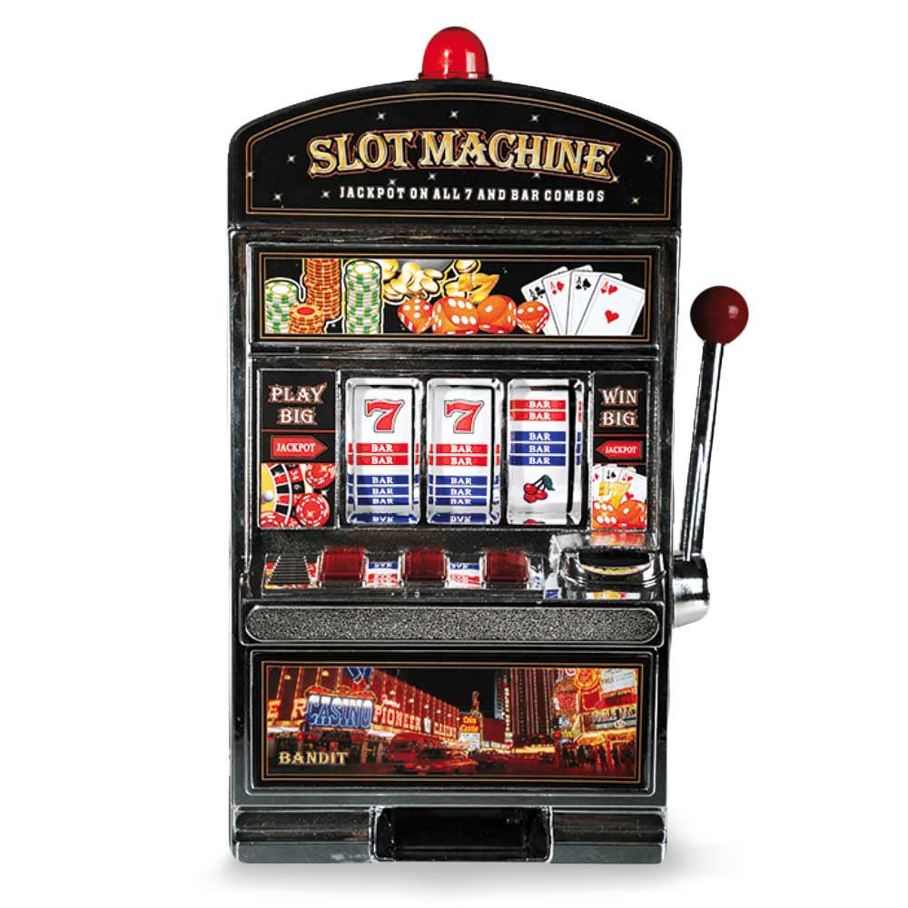

# Project Paramibo 
(Gok machine)

## taakverdeling

3e jaars SD : Furkan en Mo doen de hendel

3e jaars GA : .../ spin mechanism (angel, Milad)

2e jaars GA: ... wordt nog besproken ( Sven en Bob)

2e jaars SD : doen de knoppen (Moiza en Joris)

Tech lead : Ik, tyrone help bij de knoppen waar de 2e jaars SD aan werken. en waar het nog nodig is

## uitleg

we gaan een pvp gok machine maken die multiplayer is. met een hendel en 2 knoppen. 2 spelers nemen het tegen elkaar op, en wie het meeste geld wint die neemt de victory

